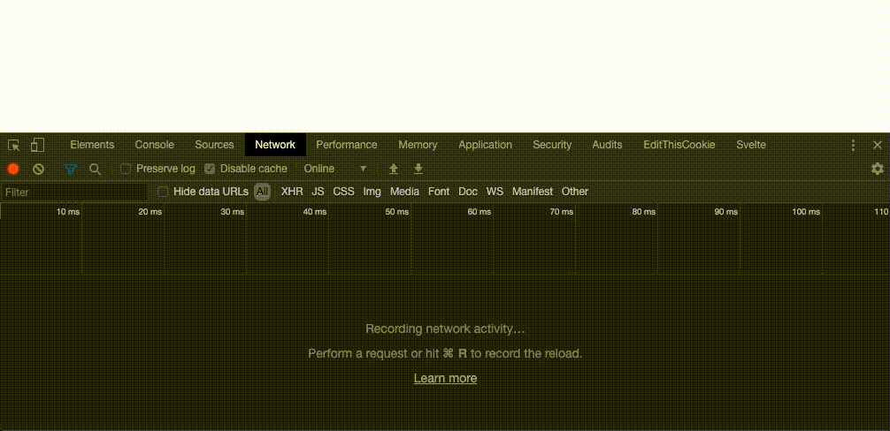

# svelte-parcel-code-splitting-template
Template for using Svelte with Parcel (Code-Splitting and async Loading of svelte components enabled)

**I needed the following features in this project:**
* reliable & easy to use bundling without the configuration hell of webpack
* basic svelte setup with enabled sass support
* preferably code-splitting + async loading of componentents

**end up using this..**
* [Parcel.js](https://parceljs.org/) is the bundler of my choice, since i tried them all for several purposes  
and I simply love the zero configuration philosophy
  * in Parcel.js everything configuration is in a dedicated configuration file, due to this fact a __svelte.config.js__ is necessary to use scss within svelte
* for loading svelte-components async with dynamic imports this template uses [svelte-loadable](https://github.com/kaisermann/svelte-loadable)  

